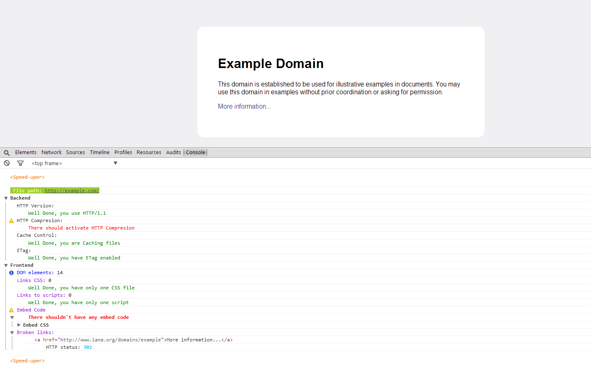

# speed-uper.js

 The easiest way to view the things you can do to speed-up your web

## How to use it

You only need to dowload speed-uper.js, configure it and put that `script` tag on your HTML file.

```html
<script defer src="speed-uper.js"></script>
```

To see the results just open the JS console `F12` on dev tools.





## What do you need

* A PHP server (for now), to execute serverside.php in ptitions of speed-uper.js

* You must configure the variable serverside on speed-uper.js width the path to the serverside file


## Configurations

#### speed-uper.js

In that file you have 2 variables to confgure:

* **server**
 * In that variable you only can put 2 options:
    * _remote_
        * If your `serverside` script is on the same server as your **_speed-uper.js_** file
    * _local_
        * If your `serverside` script is other server as your **_speed-uper.js_** file
 * By default is in **local**
* **serverside**
 * In that variable you must put the **path/link** to the serverside script
 * Example:
    * **Path:** `../vendor/speed-uper/serverside.php`
    * **Link:** `http://www.example.com/vendor/speed-uper/serverside.php`
 * By default is in the **same folder** as speed-uper.js

#### .htaccess

**You must garant access to serverside script**

Apache example:
```apache

<Files "serverside.php">
    Order Allow,Deny
    Allow from all
</Files>

```

If you use a **remote** server you must activate _CORS_ on the server that have serverside script

Apache example:
```apache

Header add Access-Control-Allow-Origin "the-server-that-have-speed-uper.js"

```

Or if you want to create a public server for the serverside script you can do that:

Apache example:
```apache

Header add Access-Control-Allow-Origin *

```


## Important

* **You never should put this script in a production server because it slows so much the web charging**

* If you want to use a external server for the backend make you sure that the backend server doesn't block your ip for anti DDoS attacks protection

## License

That script was licenced under **_[BSD 3-Clause License](LICENSE)_**